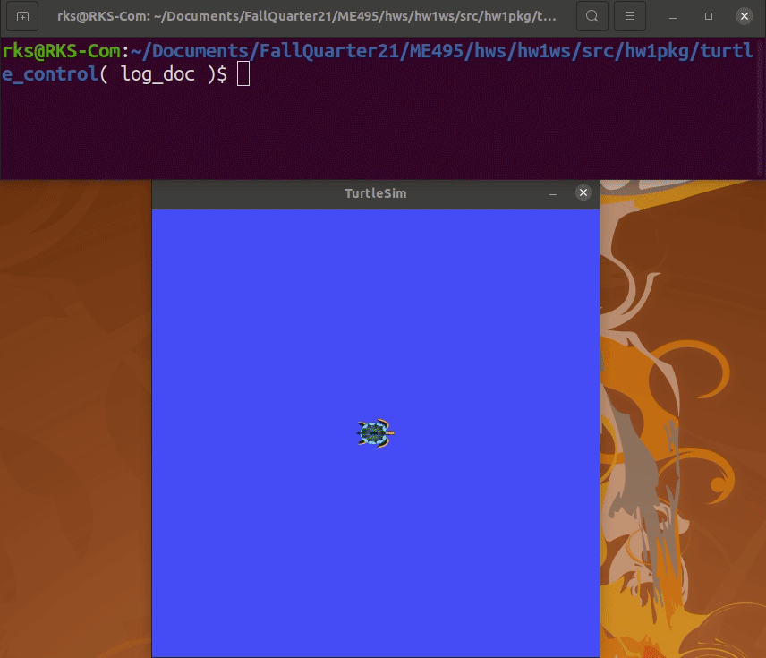

# ME495 Homework 1: Kame Turtle

Author: **Ryan King-Shepard**

## Contents
* `media/` - directory for screenshots and gifs of ROS performance
* `inspection.md` - README from [crazy_turtle respository](https://github.com/m-elwin/crazy_turtle). 
Edited to fill in `${ITEM}` blanks. 
* `mover` - Node from [crazy_turtle respository](https://github.com/m-elwin/crazy_turtle). 
Edited to fill in `{?}`.
* `turtle_control` - Custom ROS package of interest and what the bulk of the this README will cover.

## Turtle Control Package

### Description

A ROS package that translates 2D velocity commands into turtlesim in order to have a turtle follow waypoints. Read more about the awesome package in it's [README](turtle_control/README.md)

Example of turtle_control:

