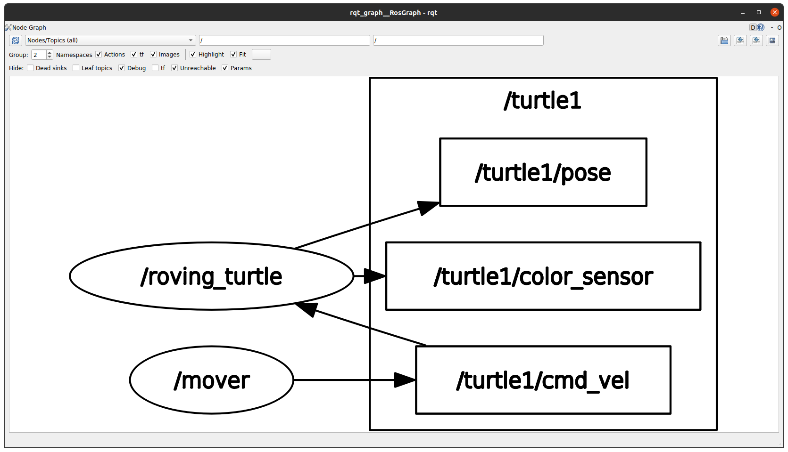

# CRAZY TURTLE
Demonstration package for ME495.
This README is intentionally vague.
Figuring out how this package works and filling in the details is part of the
exercise. Replace the the blanks marked with `${ITEM}` with your answer.
Unless otherwise specified, list the command and all arguments that you passed to it.

## Setup Instructions
1. Compile the workspace by executing `catkin_make`
2. Initialize the ROS environment (i.e., set the necessary ROS environment variables) by executing `source devel/setup.bash`
3. Make sure no other ROS nodes are running prior to starting. 
3. Run the launchfile `launch directory` by executing `roslaunch crazy_turtle go_crazy_turtle.launch`
4. When running you can see a visual depiction of the ROS graph using the `rqt_graph` command.
   The ROS graph, including all topics and node labels, looks like:
   

## Runtime Information
The `launchfile` from above should be running at all times when executing these commands.
If the nodes launched from the `launchfile` are not running, you will get incorrect results.

5. Use the ROS command `rosnode list` to list all the nodes that are running.
   The output of the command looks like
   ```
   /mover
   /rosout
   /roving_turtle
   ```
6. Use the ROS command `rostopic list` to list the topics
   The output of the command looks like
   ```
   /rosout
   /rosout_agg
   /turtle1/cmd_vel
   /turtle1/color_sensor
   /turtle1/pose
   ```

7. Use the ROS command `rostopic hz /turtle1/cmd_vel` to verify that the frequency of
   the `/turtle1/cmd_vel` topic is `120 Hz`

8. Use the ROS command `rosservice list` to list the services.
   The output of the command looks like
   ```
   /clear
   /kill
   /mover/get_loggers
   /mover/set_logger_level
   /reset
   /rosout/get_loggers
   /rosout/set_logger_level
   /roving_turtle/get_loggers
   /roving_turtle/set_logger_level
   /spawn
   /switch
   /turtle1/set_pen
   /turtle1/teleport_absolute
   /turtle1/teleport_relative
   ```
9. Use the ROS command `rosservice info /switch` to view information about the `/switch` service.
   The type of the `/switch` service is `crazy_turtle/Switch` and it is offered by
   the `/mover` node.

10. Use the ROS command `rosparam list` to list the parameters that are loaded
    into the parameter server.
    The output of the command looks like
    ```
    /mover/velocity
    /rosdistro
    /roslaunch/uris/host_rks_com__33717
    /roslaunch/uris/host_rks_com__38035
    /roslaunch/uris/host_rks_com__44085
    /rosversion
    /roving_turtle/background_b
    /roving_turtle/background_g
    /roving_turtle/background_r
    /run_id
    ```

## Package and Dependencies
11. Use the ROS command `rossrv package crazy_turtle` to list the types of services defined by `crazy_turtle`
    The output of the command looks like
    ```
    crazy_turtle/Switch
    ```
12. Use the ROS command `rospack depends1 crazy_turtle` to list the immediate (direct) dependencies of `crazy_turtle`
   The output of the command looks like
   ```
   rospy
   message_runtime
   turtlesim
   ```
## Live Interaction
13. Use the ROS command 
   ```
   rosservice call /switch "mixer: {x: {float32}, y: {float32}, theta: {float32}, linear_velocity: {float32}, angular_velocity: {float32}}"
   ``` 
to call the `/switch` service. **Note**: When calling the command, fill the `{float32}` values with float numbers. 

   The command returns `x: {float32}, y: {float32}` and the turtle `changes to a new turtle placed at a new location. It looks like the new_x is old_x*angular_velocity and new_y is old_y*linear_velocity. `
    (Hint: use `rossrv info` on the type of the `/switch` service to see the parameters.
     To test the behavior, look at the code or try calling with `x = 1`, `y = 1`, once with `linear_velocity = 0` and `angular_velocity = 0` and once with these at different nonzero values.)

14. What is the value of the `/mover/velocity` parameter? `4.5`
15. What happens to the turtle's motion if you change `/mover/velocity` to 10 while the turtlesim and mover node are running? It stays the same
16. Use the ROS command `rosnode kill /mover` to kill the `/mover` node.
17. Use the ROS command `rosrun crazy_turtle mover /cmd_vel:=/turtle1/cmd_vel` to start the `/mover` node. Be sure to remap `cmd_vel` to `/turtle1/cmd_vel`.
18. What happened to the turtle's velocity after relaunching `mover` ?  `The turtle moves faster `
